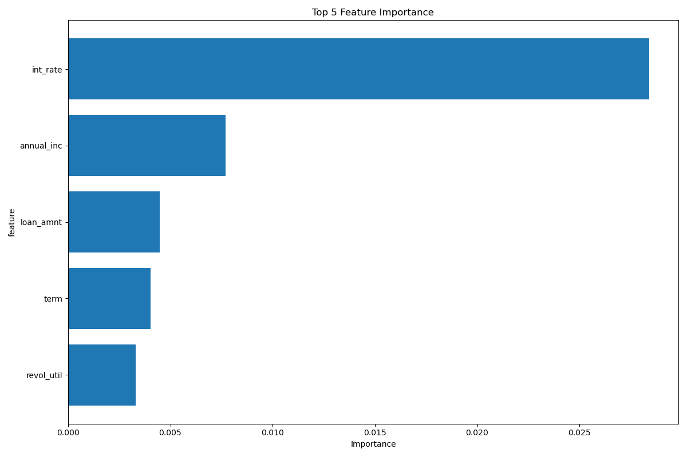

# Credit Risk Prediction using Machine Learning


> **Project Goal:** To develop a machine learning model that predicts the **likelihood of default** for loan applicants. By analyzing historical loan data, this project identifies key factors influencing credit risk to help financial institutions minimize potential losses.


*Visualization of the top 5 most influential features used by the final XGBoost model.*

---

## 📖 Table of Contents
- [Business Problem](#-business-problem)
- [Dataset](#-dataset)
- [Project Workflow](#-project-workflow)
- [Results and Evaluation](#-results-and-evaluation)
- [Tech Stack](#-tech-stack)
- [Repository Structure](#-repository-structure)
- [Installation and Setup](#-installation-and-setup)
- [How to Use the Model](#-how-to-use-the-model)
- [License](#-license)

---

## 🎯 Business Problem

Financial institutions frequently face the challenge of assessing the creditworthiness of loan applicants. An inaccurate assessment can lead to significant financial losses from loan defaults. This project aims to build an automated system that can accurately predict credit risk, enabling better decision-making.

The primary success metric is **Recall** for the "default" class. Maximizing Recall is a business priority because it focuses on correctly identifying as many high-risk borrowers as possible to minimize financial losses. The **ROC AUC** score is also used to evaluate the model's overall classification performance.

---

## 💾 Dataset

The dataset used in this project is `loan_data_2007_2014.csv`, which contains historical loan data from 2007 to 2014.

* **Data Source:** `data/loan_data_2007_2014.csv`.
* **Target Variable:** `loan_status`, which has been converted into a binary format:
    * `0`: Loan was fully paid.
    * `1`: Loan was charged off, defaulted, or is in a late payment status.

---

## 🔬 Project Workflow

This project follows a standard data science workflow:

1.  **Data Wrangling & Feature Engineering:**
    * Cleaned and prepared the data using a dedicated `wrangle` function.
    * Engineered new features, including `prop_open_acc` (proportion of open credit accounts) and `credit_history_length_months`.
    * Handled outliers in `annual_inc`, `tot_coll_amt`, and `tot_cur_bal` using a logarithmic transformation (`np.log1p`).
    * Removed irrelevant columns, features causing data leakage, and those with high multicollinearity.

2.  **Data Preprocessing:**
    * Split the data into Training, Validation, and Test sets (64%/16%/20%).
    * Created separate preprocessing pipelines for numerical and categorical features using `ColumnTransformer`:
        * **Numerical:** Missing values were imputed with the median (`SimpleImputer`), and features were scaled (`StandardScaler`).
        * **Categorical:** Missing values were imputed with the mode (`SimpleImputer`), and features were one-hot encoded (`OneHotEncoder`).

3.  **Handling Class Imbalance:**
    * Addressed the imbalanced class distribution in the training data using the `RandomOverSampler` technique from the `imbalanced-learn` library.

4.  **Modeling & Hyperparameter Tuning:**
    * Established a **Baseline Model** using `LogisticRegression`.
    * Trained and compared two more advanced models: **Random Forest** and **XGBoost**.
    * Systematically optimized hyperparameters for both models using `GridSearchCV`, with `f1-score` as the primary metric for refitting.

5.  **Model Evaluation:**
    * The final model's performance was evaluated on the unseen test set to ensure its ability to generalize to new data.

---

## 📊 Results and Evaluation

The models were evaluated on the test set using ROC AUC and Recall. **XGBoost** delivered the best performance and was selected as the final model.

| Model           | ROC AUC (Test) | Recall (Test) |
| --------------- | -------------- | ------------- |
| Random Forest   | 0.71           | 0.61          |
| **XGBoost (Final)** | **0.71** | **0.91** |

While both models achieved an identical ROC AUC score, the **XGBoost model demonstrated a vastly superior Recall score (0.91 vs. 0.61)**. This indicates that the XGBoost model is significantly more effective at identifying borrowers who are likely to default, directly aligning with the primary business objective of this project.

---

## 🛠️ Tech Stack

* **Programming Language:** Python 3.9+
* **Core Libraries:** Pandas, NumPy, Scikit-learn, XGBoost, Imbalanced-learn
* **Data Visualization:** Matplotlib, Seaborn
* **Model Persistence:** Pickle

---

## 📂 Repository Structure
.
├── data/
│   └── loan_data_2007_2014.csv
├── feat_imp.png
├── random_forest_model.pkl
├── xgb_model.pkl
├── vix_idxpartner.py
├── vix_idxpartner.ipynb
└── README.md

---

## ⚙️ Installation and Setup

To run this project locally, follow these steps:

1.  **Clone the repository:**
    ```bash
    git clone [https://github.com/](https://github.com/)<your-username>/credit-risk-prediction.git
    cd credit-risk-prediction
    ```

2.  **Create and activate a virtual environment:**
    ```bash
    python -m venv venv
    source venv/bin/activate  # On Windows, use `venv\Scripts\activate`
    ```

3.  **Install the required dependencies:**
    Create a `requirements.txt` file with the following content and run the installation command.

    **`requirements.txt`:**
    ```
    pandas
    numpy
    scikit-learn
    xgboost
    imbalanced-learn
    seaborn
    matplotlib
    ```

    **Installation command:**
    ```bash
    pip install -r requirements.txt
    ```

---

## 🚀 How to Use the Model

The final model is saved as `xgb_model.pkl`. You can use the `predict_risk` function included in the `vix_idxpartner.py` script to get predictions on new data.

Here is an example of how to load the model and make a prediction:

```python
import pandas as pd
import pickle

# Load the trained XGBoost model
with open("xgb_model.pkl", "rb") as f:
    model = pickle.load(f)

# Create a sample DataFrame with new data (ensure columns match the training data)
# This is a placeholder; replace with actual new data.
sample_data = pd.DataFrame({
    'loan_amnt': [10000], 'term': [' 36 months'], 'int_rate': [11.44], 
    'sub_grade': ['B4'], 'emp_length': ['10+ years'], 'home_ownership': ['RENT'], 
    'annual_inc': [49000.0], 'verification_status': ['Source Verified'], 
    'purpose': ['debt_consolidation'], 'dti': [20.00], 'delinq_2yrs': [0.0], 
    'inq_last_6mths': [1.0], 'mths_since_last_delinq': [35.0], 
    'mths_since_last_record': [0.0], 'pub_rec': [0.0], 'revol_util': [56.2], 
    'collections_12_mths_ex_med': [0.0], 'mths_since_last_major_derog': [0.0], 
    'policy_code': [1.0], 'application_type': ['INDIVIDUAL'], 'acc_now_delinq': [0.0], 
    'tot_coll_amt': [0.0], 'tot_cur_bal': [13644.0], 'prop_open_acc': [0.3], 
    'credit_history_length_months': [200]
    # ... add all other required feature columns
})

# Define the prediction function (copied from the script for standalone use)
def predict_risk(data, model):
    """
    Predict credit risk from new data and return the probability series.
    """
    probabilities = model.predict_proba(data)[:, 1]
    risk_proba = [f"{(proba * 100):.2f}%" for proba in probabilities]
    return pd.Series(risk_proba, index=data.index, name="credit_risk_proba")

# Get the credit risk probability
risk_prediction = predict_risk(sample_data, model)
print(risk_prediction)
```
📜 License

This project is licensed under the MIT License.
